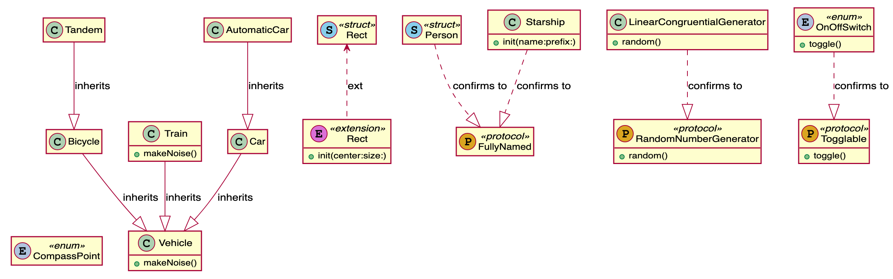

# Swift to PlantUML (work-in-progress)

Using SourceKitten and PlantUML to generate UML class diagrams from swift source code.




## Usage


`sh plantuml.sh demo.swift`

will produce this diagram [Full Image](https://www.plantuml.com/plantuml/svg/hLPDRzim3BtxLmYzB46I7hBB41H1qtOT2cnjK1Sxx3AeCcDhaIL3ajTcm_vx9TbE93iVBh1JAFBnYNwIo4INIcEfovn57v3I6qPvYb812cKW8I8CAuNElaD62OCpX1MgRVGt6kLu3VU2AXWCe-XV0xwYPDE0Qzk0T_4dp1F8NRWomwZ4b5T1QntUvXfB1pE_0S6Yr2B7cf86u3i2v8qed-iwAnDTNA31vx6G9AF94C6h1gweu6W-3n8VWMYNPWsN58zHlDvSiHA6HaLP6lUnd4_7TnfHJlM00DSWPuh-WPd_uRSbOvjxd4FY-7PBHxeSVn4i0Vue36yXXHP4i7OnIv1AL2fNPi-FYCrTKHajN6Qps1RCJH6pGiAAlWO5FuaqPRYHUhiwLUv8MsHuw0_yORMANwWccIFprhMaNscQwLW3iEf3W9VvORwTZEzKS97MUTPuh_1JJ_bfJ-clHMclmmtME1Qb99MO7Uz9KIad4d9pjGOh8LrwS5OreKyUPWK7cqa0hnfl7RvfyO9bedw053wwxUrHtXqtPul9sX4qYwCAZefIPOEVXcLKY28eVyVqFscc7_ksaGKNsdJPfMazfZbPNtMZEcwJDL4YXwMalx66Rw0paGGrr3btzhmuPXso8D2RxfQo1jHXRCUiHfRKys-9--rsQATzk-mXQqRDP3BVpgWPGfGR2geLYkfXO-CDDeoxUNCmtKwFWy5WnbYK_GqGTP-rCQzZ6mWHV4Lbhf0MADhsr1Cul-zPwAwfjf5Dbx6e_Lm-mdMpDi1_reucVdZ-PITV9z9jHnskpgDlCUwDd-Qj9l7vUJrUP_RLHVMpDjxcPLR-I-29_SSJlG40)

Generates the below content, which you can copy and paste it in [PlantText](https://www.planttext.com/?text=hLPDRzim3BtxLmYzB46I7hBB41H1qtOT2cnjK1Sxx3AeCcDhaIL3ajTcm_vx9TbE93iVBh1JAFBnYNwIo4INIcEfovn57v3I6qPvYb812cKW8I8CAuNElaD62OCpX1MgRVGt6kLu3VU2AXWCe-XV0xwYPDE0Qzk0T_4dp1F8NRWomwZ4b5T1QntUvXfB1pE_0S6Yr2B7cf86u3i2v8qed-iwAnDTNA31vx6G9AF94C6h1gweu6W-3n8VWMYNPWsN58zHlDvSiHA6HaLP6lUnd4_7TnfHJlM00DSWPuh-WPd_uRSbOvjxd4FY-7PBHxeSVn4i0Vue36yXXHP4i7OnIv1AL2fNPi-FYCrTKHajN6Qps1RCJH6pGiAAlWO5FuaqPRYHUhiwLUv8MsHuw0_yORMANwWccIFprhMaNscQwLW3iEf3W9VvORwTZEzKS97MUTPuh_1JJ_bfJ-clHMclmmtME1Qb99MO7Uz9KIad4d9pjGOh8LrwS5OreKyUPWK7cqa0hnfl7RvfyO9bedw053wwxUrHtXqtPul9sX4qYwCAZefIPOEVXcLKY28eVyVqFscc7_ksaGKNsdJPfMazfZbPNtMZEcwJDL4YXwMalx66Rw0paGGrr3btzhmuPXso8D2RxfQo1jHXRCUiHfRKys-9--rsQATzk-mXQqRDP3BVpgWPGfGR2geLYkfXO-CDDeoxUNCmtKwFWy5WnbYK_GqGTP-rCQzZ6mWHV4Lbhf0MADhsr1Cul-zPwAwfjf5Dbx6e_Lm-mdMpDi1_reucVdZ-PITV9z9jHnskpgDlCUwDd-Qj9l7vUJrUP_RLHVMpDjxcPLR-I-29_SSJlG40)

```


@startuml
' styling goes here
class "Vehicle" as Vehicle {
  +makeNoise()

}
class "Bicycle" as Bicycle {

}
class "Tandem" as Tandem {

}
class "Train" as Train {
  +makeNoise()

}
class "Car" as Car {

}
class "AutomaticCar" as AutomaticCar {

}
class "Double" as Double << (E,orchid) extension >> {

}
class "Rect" as Rect << (S, SkyBlue) struct >> {

}
class "Rect" as Rect8 << (E,orchid) extension >> {
  +init(center:size:)

}
class "FullyNamed" as FullyNamed << (P,GoldenRod) protocol >> {

}
class "Person" as Person << (S, SkyBlue) struct >> {

}
class "Starship" as Starship {
  +init(name:prefix:)

}
class "Togglable" as Togglable << (P,GoldenRod) protocol >> {
  +toggle()

}
class "OnOffSwitch" as OnOffSwitch << (E,LightSteelBlue) enum >> {
  +toggle()

}
class "Named" as Named << (P,GoldenRod) protocol >> {

}
class "Aged" as Aged << (P,GoldenRod) protocol >> {

}
class "Person2" as Person2 << (S, SkyBlue) struct >> {

}
class "CounterDataSource" as CounterDataSource << (P,GoldenRod) protocol >> {
  +increment(forCount:)

}
class "Counter" as Counter {
  +increment()

}
class "ThreeSource" as ThreeSource {

}
class "TowardsZeroSource" as TowardsZeroSource {
  +increment(forCount:)

}
class "IntStack" as IntStack << (S, SkyBlue) struct >> {
  +push(_:)
  +pop()

}
class "Stack" as Stack << (S, SkyBlue) struct >> {
  +push(_:)
  +pop()

}
class "Stack" as Stack23 << (E,orchid) extension >> {

}
class "AnotherPublicClass" as AnotherPublicClass {
  -somePrivateMethod()

}
class "AnotherInternalClass" as AnotherInternalClass {
  -somePrivateMethod()

}
class "AnotherFilePrivateClass" as AnotherFilePrivateClass {
  +someFilePrivateMethod()
  -somePrivateMethod()

}
class "AnotherPrivateClass" as AnotherPrivateClass {
  +somePrivateMethod()

}

Bicycle --> Vehicle :  inherits 
Tandem --> Bicycle :  inherits 
Train --> Vehicle :  inherits 
Car --> Vehicle :  inherits 
AutomaticCar --> Car :  inherits 
Person --> FullyNamed :  confirms to 
Starship --> FullyNamed :  confirms to 
OnOffSwitch --> Togglable :  confirms to 
Person2 --> Named :  confirms to 
Person2 --> Aged :  confirms to 
ThreeSource --> NSObject 
ThreeSource --> CounterDataSource :  confirms to 
TowardsZeroSource --> NSObject 
TowardsZeroSource --> CounterDataSource :  confirms to 
Rect <.. Rect8 : ext
Stack <.. Stack23 : ext
@enduml


```

## Dependencies


* [SourceKitten](https://github.com/jpsim/SourceKitten)
* [jq](https://github.com/stedolan/jq)
* [NodeJS](https://nodejs.org/en/)


* Generates output for [PlantText*](https://www.planttext.com/)
